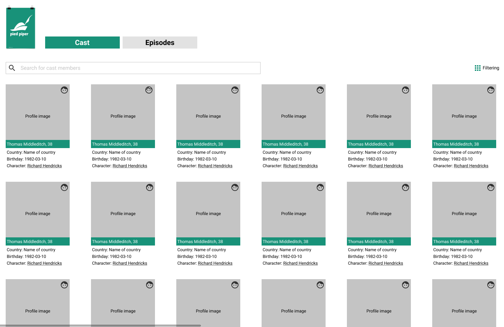

# Neurons Front-end Developer Coding Test
Be sure to read **all** of this document carefully, and follow the guidelines within.

## Context

Use React w/ TypeScript to implement the following mock-up. You will need to leverage an open API for Tv Show data to fill in the details and functionality as described below. You are only required to complete the desktop views, unless otherwise instructed.

Use this Figma file to see the Product UX/Design guidelines, you are welcome to improve the design experience as you see fit. 

> [Source Figma file](https://www.figma.com/file/F6LUtupkwm21hrLLza4A5n/TV-Shows?node-id=0%3A1)


Nb! Some screens are not designed but there are inspirations for implementation, part of the test is to see your approach to the more unknown. 

## Requirements

### TV Show data API

TV Show and Cast data 
https://api.tvmaze.com/shows/143?embed=cast

Tv Show Episodes 
https://api.tvmaze.com/shows/143/episodes?specials=1

Full API and usage documentation.
https://www.tvmaze.com/api


### Page Structure

```
Main
  - Navigation
    - List the Cast members of the TV show 
    - List the Episodes of the TV show 
  - Section (Cast)
    - Search bar 
    - Filtering menu 
      - List of cast members 
  - Section (Episodes)
    - Search bar 
    - Filtering menu 
      - List of episodes of the tv show
Detail Cards(Cast)
  - Profile image 
  - Gender icon 
  - Actor name, Age : Link to profile page 
  - Country
  - Character: Name in the show : Link to Character page 
  - Birthday
Detail Cards(Episodes)
  - Profile image 
  - Episode name : link til tvmaze 
  - Episode description 
  - Season nr / Episode nr 
  - Air time
```

### Functionality
- There are 2 tab of content one for Cast members and one for the Episodes 
- Under each pages you can search for 
 - Cast : Name or Character name 
 - Episode: Name of the show or part of the description of the show. 
- Under each pages you can filter the list of content  
- Each page has options of filters e.g Country that can be dynamic created based on content. 
- Filtering options should be saved in the session as well as when I return to the application. 
- All data should come from Realtime API 


### Tech stack

- TypeScript oriented (JavaScipt can be used, but we strongly prefer TypeScript)
  - Use **React**
  - _Do not_ use any React boilerplate, such as Create React App
- Feel free to use a preprocessor, CSS-in-JS, or JSS tool but _do not_ use any pre-styled frameworks or libraries
  - The general rule of thumb is: you should write your own styling for your components, do not use "pre-made" tools and utilities

  - There are a few reasons we do this:
    - we care about pixel perfect implementation
    - we want to see your understanding of CSS and styling practices
    - we want to see your understanding Design/UI/Components skills 

  - USE:
    - Styled-Components
    - Emotion
    - SCSS
    - SASS
    - LESS
    - CSS

  - AVOID:
    - Tailwind
    - Bootstrap
    - Material UI
    - Semantic UI

Not that we are against these frameworks but more that we can see how you would build these components yourself. 


### Bonus

- Make the application accessible
- Write clear **documentation** on how the app was designed and how to run the code
- Implement useful testing
- Provide components in [Storybook (https://storybook.js.org)
- Write concise and clear commit messages
- Provide an online demo of the application
- Include subtle animations to focus attention
- Created a Responsive version of the application
- Describe improvement opportunities when you conclude

## What We Care About
Use any libraries that you would normally use if this were a real production App. Be prepared to justify those choices. Please note: _we care more about how you approach the problem than the end result. Code cleanliness and design are more important than using the "right" library._

Here's what you should strive for:

- Good use of current TypeScript, HTML, CSS, and performance best practices
- Solid testing approach
- Extensible code
- Thorough explanation of decisions and tradeoffs

## Q&A

> Where should I send back the result when I'm done?

Fork this repo and the hiring manager an email when you think you are done. There is no deadline for this task unless otherwise noted to you directly.

> What if I have a question?

Please write the hiring manager an email with any questions you may have along the way. 


-------------------------------------------------------------------------------------
Credit to https://github.com/Superformula/frontend-test for the test inspiration 
